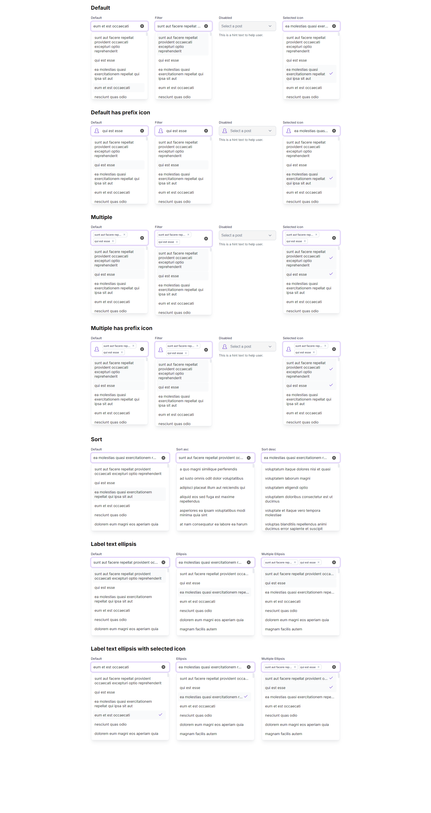
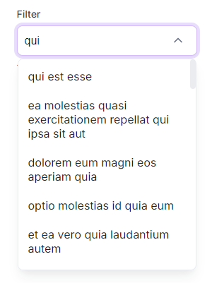
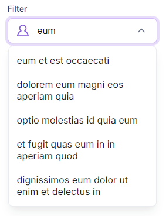
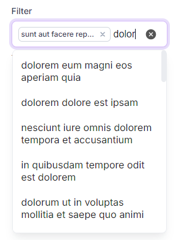
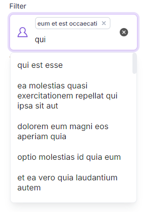

# CUSTOM REACT SELECT COMPONENT

## IMAGES

### Full page view (All select types)


### Default mode filter


### Default mode filter with prefix icon


### Multiple mode filter


### Multiple mode filter with prefix icon



Project created with `create-react-app`

```bash
npx create-react-app <app-name> --template typescript
```


```
node version: 20.16.0 
npm version: 10.8.1
```

## API
### Props
| Prop  | Type | Default | Required | Description |
| ------------- | ------------- | ------------- | ------------- | ------------- |
| prefixIcon | `ReactNode \| ReactElement`  | `-` | no | An icon that appears before select. |
| label | `string`  | `-` | no | Label element for select. |
| hint | `string`  | `-` | no | Hint element for select. |
| options | `Array<any>`  | `[]` | yes | Option array for select options. |
| selectedIcon | `ReactNode \| ReactElement`  | `-` | no | An icon that appears right of selected option. |
| filter | `boolean`  | `-` | no | Allow to search for value. |
| sorting | `{ sortKey: string, sortType: 'asc' \| 'desc' }`  | `-` | no | Allow sorting options using `sortKey`. |
| disabled | `boolean`  | `-` | no | Set select to disabled. |
| multiple | `boolean`  | `-` | no | Allows to select multiple items. |
| closeOnSelect | `boolean`  | single: `false` multiple: `true` | no | Whether to close the menu when a value is selected. |
| ellipsisLabel | `boolean`  | `-` | no | Labels consisting of more than one line end with '...'. |
| bindLabel | `string`  | `label` | no | Object property to use for label. |
| bindValue | `string`  | `value` | no | Object property to use for selected option. |
| placeHolder | `string`  | `-` | no | Placeholder text. |
| notFoundText | `string`  | `-` | no | Filter not found text. |


### Events

| Event  | Description |
| ------------- | ------------- |
| (onChange)  | Fired when item is selected |


## Available Scripts
In the project directory, you can run:

### `npm start`

Runs the app in the development mode.\
Open [http://localhost:3000](http://localhost:3000) to view it in the browser.